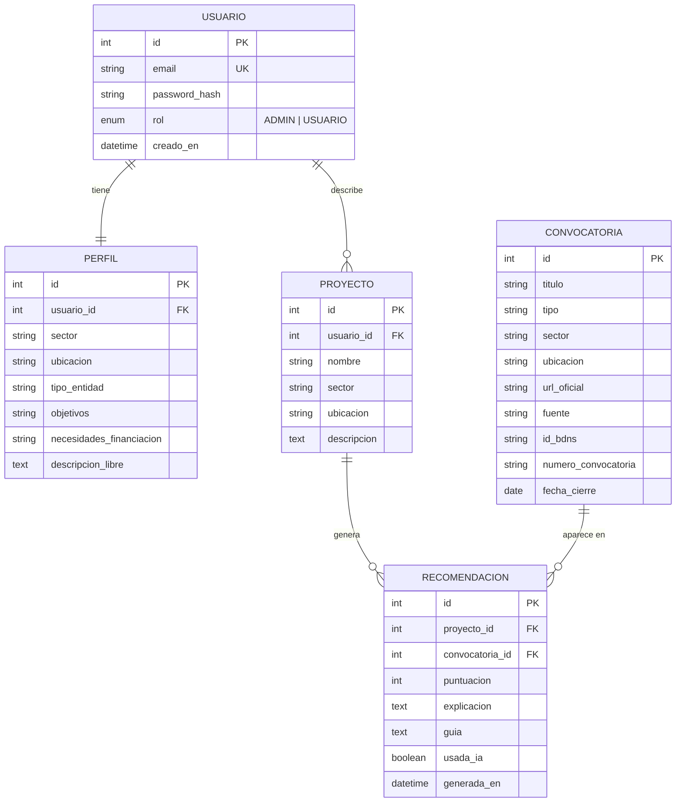
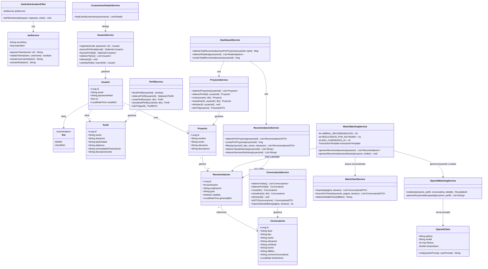
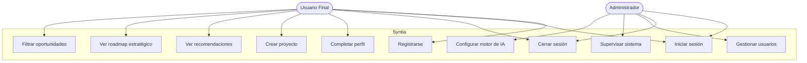
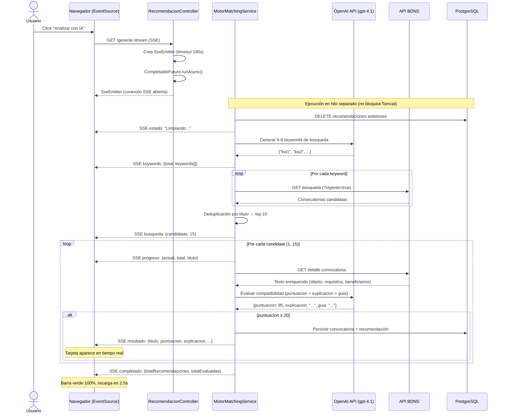
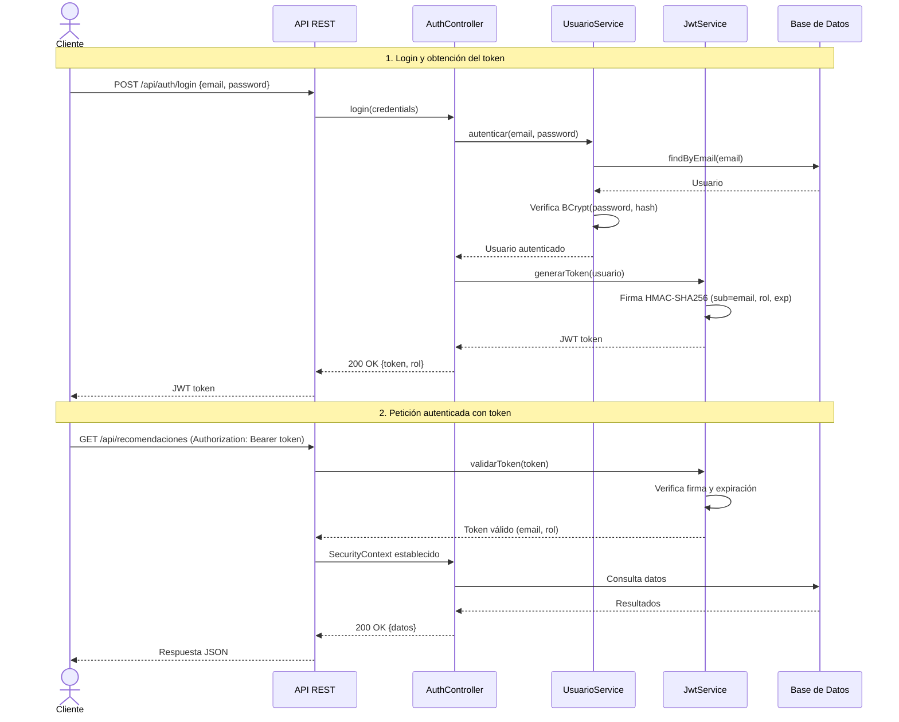
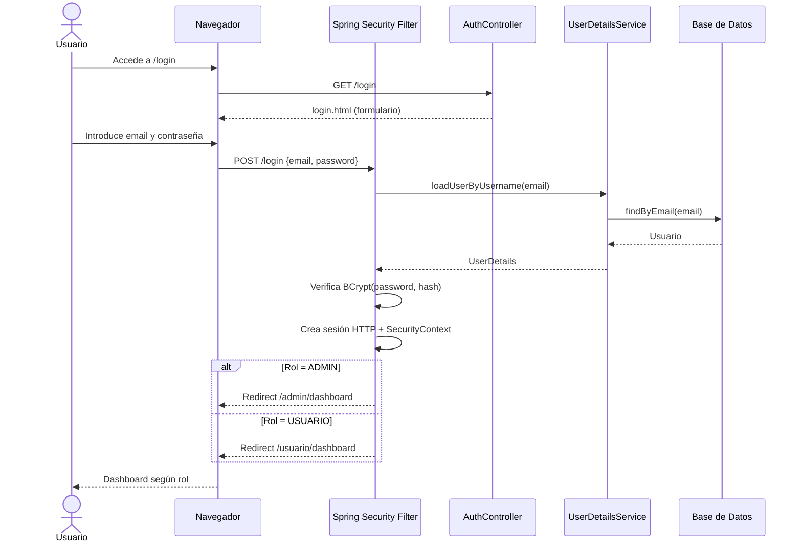

# Diagramas Syntia – Versión revisada y completa (2026-03-10)

## Alineación Arquitectónica Vigente (2026-03-13)

> Interpretar los diagramas con estas reglas de prioridad:
>
> - Frontend objetivo: `Angular` consumiendo `API REST`.
> - Arquitectura de presentación: SPA cliente sin motor de plantillas server-side.
> - Contrato principal del sistema: endpoints en `controller/api/` con JWT.
> - Pipeline `BDNS+IA` y lógica de negocio permanecen en servicios.
> - SSE (`SseEmitter`) se mantiene para feedback en tiempo real al cliente SPA.

---

## 1. Modelo Entidad-Relación (ER)

---

## 2. Diagrama de Clases UML

> **Actualizado a 2026-03-10 (v3.0.0)** — Refleja el estado real de la implementación incluyendo SSE streaming, OpenAI y BDNS.

---

## 3. Diagrama de Casos de Uso UML

---

## 4. Diagrama de Secuencia UML – Flujo de Recomendación con SSE Streaming

> **Actualizado a v3.0.0** — Refleja el flujo real con SSE, OpenAI y BDNS.

---

## 5. Diagrama de Secuencia UML – Flujo de Autenticación JWT (API REST)

---

## 6. Diagrama de Secuencia UML – Flujo de Login API JWT

