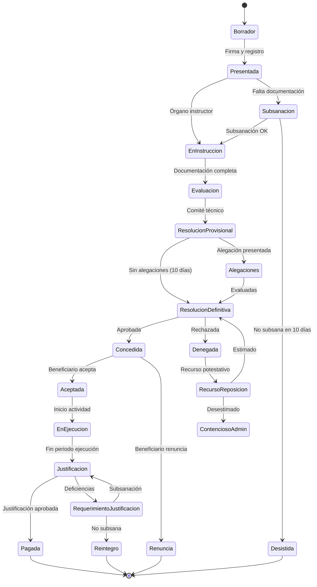

# Auditoría del Flujo de Solicitud de Subvenciones — Syntia

## Alineación Arquitectónica Vigente (2026-03-13)

> Documento archivado con valor histórico; para implementación vigente aplicar esta directriz:
>
> - Frontend objetivo: `Angular` consumiendo `API REST`.
> - Interfaz de presentación: cliente SPA en transición controlada.
> - La guía y el flujo de subvenciones deben exponerse prioritariamente por `controller/api/` con JWT.
> - El pipeline `BDNS+IA` y su lógica permanecen en servicios backend.

> **Fecha:** 2026-03-10  
> **Versión del proyecto:** v3.1.0  
> **Estado:** 📁 ARCHIVADO — Los hallazgos de esta auditoría fueron resueltos en v3.4.0 con la implementación de `OpenAiGuiaService` (guía enriquecida con system prompt especializado en LGS 38/2003) y la galería visual interactiva en `recomendaciones.html`.  
> **Autor:** Consultor Senior en Subvenciones Públicas y Procesos Administrativos Digitales  
> **Alcance:** Auditoría de `/docs`, análisis del flujo real de convocatorias BDNS, esquema visual, modelado REST, wireframes y rediseño de guía interna.

---

## FASE 1 — AUDITORÍA DE `/docs`

### 1.1 Evaluación documental completa

#### Aciertos

| Aspecto | Evaluación | Documento |
|---------|-----------|-----------|
| Arquitectura técnica del motor de matching | ✅ Excelente: flujo keyword→BDNS→OpenAI→persistencia perfectamente documentado | `07-fases`, `08-informe` |
| System prompt para guía de 5 pasos | ✅ Bien estructurado: define PASO 1-5 con roles claros (elegibilidad, documentación, presentación, plazos, advertencias) | `OpenAiMatchingService.java` |
| Aviso legal de carácter orientativo | ✅ Presente en UI y documentación | `01-requisitos.md` §7, `recomendaciones.html` |
| Integración con BDNS real | ✅ Búsqueda directa por keywords con filtro `vigente=true` | `BdnsClientService.java` |
| Detalle enriquecido de convocatorias | ✅ `obtenerDetalleTexto(idBdns)` obtiene objeto, requisitos y beneficiarios | `MotorMatchingService.java` |
| Modelo de datos completo | ✅ Campo `guia` (TEXT) en `Recomendacion` almacena los 5 pasos | `06-diagramas.md` |

#### Carencias críticas

| # | Carencia | Impacto | Documento afectado |
|---|---------|---------|-------------------|
| C1 | **No existe documentación del flujo real de solicitud de una subvención** | 🔴 Alto: La guía de 5 pasos se genera sin un modelo de referencia documentado del procedimiento administrativo real | Todos — falta documento |
| C2 | **No se documenta el ciclo de vida completo de una solicitud** (desde publicación en BDNS hasta justificación final) | 🔴 Alto: El usuario recibe una guía que termina en "presentar solicitud" pero el proceso real tiene 10+ fases posteriores | `01-requisitos.md` |
| C3 | **No se distinguen tipos de procedimiento** (concurrencia competitiva vs. orden de presentación vs. convocatoria abierta) | 🟡 Medio: La guía de IA trata todas las convocatorias como si tuvieran el mismo procedimiento | `OpenAiMatchingService.java` |
| C4 | **No se documenta la diversidad de sedes electrónicas** | 🟡 Medio: Cada comunidad autónoma y ministerio tiene su propia sede, con requisitos técnicos distintos (certificados, Cl@ve, AutoFirma) | Falta documento |
| C5 | **No hay referencia a la Ley 38/2003 General de Subvenciones** ni al RD 887/2006 (Reglamento) | 🔴 Alto: Son las normas marco de todo el proceso | `01-requisitos.md` |
| C6 | **Los 5 pasos del system prompt no cubren todas las fases reales** | 🔴 Alto: Faltan fases como subsanación, alegaciones, resolución provisional, aceptación, justificación, reintegros | `OpenAiMatchingService.java` |
| C7 | **No se documenta la diferencia entre extracto BOE/BOJA/DOGC y texto íntegro de bases reguladoras** | 🟡 Medio: El usuario necesita saber que el extracto es un resumen y que las bases reguladoras contienen los requisitos reales | Falta documento |
| C8 | **No hay mapeo entre campos de `Convocatoria` y datos reales del BOE/BDNS** | 🟡 Medio: El campo `tipo` no distingue entre "subvención a fondo perdido", "préstamo bonificado", "anticipo reembolsable" | `03-especificaciones-tecnicas.md` |
| C9 | **La guía no diferencia entre solicitud telemática obligatoria y presencial** | 🟡 Medio: Desde 2016 (Ley 39/2015 art. 14.2) los profesionales están obligados a tramitación electrónica | Falta |
| C10 | **No se documenta el régimen de justificación** (cuenta justificativa simplificada vs. ordinaria vs. módulos) | 🟡 Medio: Es la fase que más rechazos genera | Falta |

#### Riesgos identificados

| Riesgo | Probabilidad | Impacto | Mitigación propuesta |
|--------|-------------|---------|---------------------|
| El usuario presenta solicitud sin documentación obligatoria porque la guía IA la omitió | Alta | 🔴 Exclusión definitiva | Documentar checklist por tipo de convocatoria; advertencia prominente en UI |
| El usuario pierde el plazo porque la guía no distingue entre plazo BOE/BOJA y plazo desde día siguiente hábil | Alta | 🔴 Exclusión por extemporánea | Calcular y mostrar fecha límite real con días hábiles |
| El usuario no usa el medio de identificación correcto (certificado vs. Cl@ve nivel sustancial) | Media | 🔴 No puede acceder a la sede | Documentar requisitos de acceso por tipo de sede electrónica |
| El usuario confunde "extracto de convocatoria" con "bases reguladoras" y no lee los requisitos completos | Alta | 🟡 Requisitos incumplidos | Enlazar siempre a las bases reguladoras, no solo al extracto |
| La guía de IA genera pasos genéricos cuando no tiene detalle de la convocatoria | Alta | 🟡 Guía inútil para el usuario | Mejorar el prompt para que indique explícitamente "datos insuficientes — consultar fuente oficial" |

#### Nivel de alineación con el procedimiento real

**BAJO** — La documentación interna cubre el motor técnico de matching (excelente) pero no documenta el proceso administrativo real de solicitud de subvenciones públicas en España. Un usuario sin experiencia NO podría completar una solicitud con la guía actual, porque:

1. No sabe qué tipo de identificación necesita.
2. No sabe dónde encontrar las bases reguladoras (vs. extracto).
3. No conoce las fases posteriores a la presentación.
4. No tiene checklist de documentación mínima obligatoria.
5. Los 5 pasos de la IA son orientativos pero no operativos.

---

## FASE 2 — INVESTIGACIÓN DEL PROCEDIMIENTO OFICIAL DE SOLICITUD

### 2.1 Marco normativo vigente

| Norma | Alcance | Relevancia para Syntia |
|-------|---------|----------------------|
| **Ley 38/2003, de 17 de noviembre, General de Subvenciones (LGS)** | Marco general estatal para la concesión de subvenciones públicas | Define requisitos de beneficiarios, obligaciones, justificación, reintegros |
| **RD 887/2006, de 21 de julio** (Reglamento LGS) | Desarrollo reglamentario de la LGS | Detalla procedimiento, plazos, documentación, cuenta justificativa |
| **Ley 39/2015, de 1 de octubre** (LPACAP) | Procedimiento administrativo común | Regula la tramitación electrónica, plazos, subsanación, recursos |
| **Ley 40/2015, de 1 de octubre** (LRJSP) | Régimen jurídico del sector público | Organización administrativa, competencias, publicidad |
| **Normativa autonómica** (Ley de subvenciones de cada CCAA) | Complementa la LGS con especialidades autonómicas | Cada CCAA puede tener requisitos adicionales |
| **Reglamento (UE) 2021/241** | Plan de Recuperación (fondos Next Generation EU) | Aplica a convocatorias con fondos europeos (requisitos DNSH, etiquetado climático, etc.) |

### 2.2 Requisitos legales para ser beneficiario (LGS art. 13)

| # | Requisito | ¿Está en `/docs`? | ¿Está en la guía IA? | Discrepancia |
|---|----------|-------------------|---------------------|-------------|
| 1 | No estar incurso en prohibiciones del art. 13.2 LGS | ❌ No | ⚠️ Parcial — la IA puede mencionarlo si está en el detalle BDNS | La guía no lo incluye sistemáticamente |
| 2 | Estar al corriente de obligaciones tributarias (AEAT) | ❌ No | ⚠️ Parcial | Requisito universal, debería estar siempre |
| 3 | Estar al corriente de obligaciones con la Seguridad Social (TGSS) | ❌ No | ⚠️ Parcial | Requisito universal, debería estar siempre |
| 4 | Estar al corriente de obligaciones de reintegro de subvenciones | ❌ No | ❌ No | Nunca mencionado |
| 5 | No tener la residencia fiscal en paraíso fiscal | ❌ No | ❌ No | Nunca mencionado |
| 6 | Hallarse al corriente de pago de obligaciones por reintegro | ❌ No | ❌ No | Nunca mencionado |
| 7 | No haber sido sancionado con pérdida de derecho a subvención | ❌ No | ❌ No | Nunca mencionado |

### 2.3 Documentación obligatoria habitual

| # | Documento | Frecuencia | En `/docs` | En guía IA |
|---|----------|-----------|-----------|-----------|
| 1 | Solicitud normalizada (modelo oficial del organismo convocante) | Siempre | ❌ | ⚠️ Parcial |
| 2 | NIF/CIF del solicitante | Siempre | ❌ | ❌ |
| 3 | Certificado de estar al corriente con AEAT | Casi siempre | ❌ | ⚠️ |
| 4 | Certificado de estar al corriente con TGSS | Casi siempre | ❌ | ⚠️ |
| 5 | Declaración responsable de no estar incurso en prohibiciones (art. 13 LGS) | Siempre | ❌ | ❌ |
| 6 | Memoria técnica del proyecto/actividad | Muy frecuente | ❌ | ⚠️ |
| 7 | Presupuesto desglosado por partidas | Muy frecuente | ❌ | ⚠️ |
| 8 | Declaración de otras ayudas (minimis / acumulación) | Siempre en ayudas de Estado | ❌ | ❌ |
| 9 | Alta censal (modelo 036/037 de AEAT) | Frecuente para empresas | ❌ | ❌ |
| 10 | Escrituras de constitución y poder de representación | Para personas jurídicas | ❌ | ⚠️ |
| 11 | Plan de negocio / Plan de empresa | En convocatorias de emprendimiento | ❌ | ⚠️ |
| 12 | Certificado bancario de titularidad de cuenta | Siempre (para el pago) | ❌ | ❌ |

### 2.4 Fases del procedimiento de concesión (LGS art. 22-28)

| Fase | Descripción | Plazo típico | En `/docs` | En guía IA |
|------|------------|-------------|-----------|-----------|
| 1. Publicación | Extracto en BOE/boletín autonómico + texto íntegro de bases en BDNS | — | ❌ | ❌ |
| 2. Apertura de plazo | Desde el día siguiente a la publicación del extracto | 15-30 días hábiles | ❌ | ⚠️ |
| 3. Presentación de solicitud | Vía sede electrónica del organismo convocante | Dentro de plazo | ❌ | ⚠️ PASO 3 |
| 4. Subsanación | Si falta documentación, requerimiento con 10 días hábiles para subsanar | 10 días hábiles | ❌ | ❌ |
| 5. Instrucción | Órgano instructor verifica documentación y requisitos | Variable | ❌ | ❌ |
| 6. Evaluación/Valoración | Comité técnico puntúa las solicitudes según criterios de la convocatoria | Variable | ❌ | ⚠️ PASO 5 parcial |
| 7. Resolución provisional | Propuesta de concesión/denegación — periodo de alegaciones (10 días) | 10 días alegaciones | ❌ | ❌ |
| 8. Resolución definitiva | Resolución firme, notificación electrónica | 3-6 meses desde cierre | ❌ | ❌ |
| 9. Aceptación | El beneficiario acepta la subvención (puede ser tácita) | 10-15 días | ❌ | ❌ |
| 10. Ejecución | Realización de la actividad/inversión subvencionada | Según convocatoria | ❌ | ❌ |
| 11. Justificación | Presentación de cuenta justificativa (facturas, memorias, indicadores) | 1-3 meses tras fin | ❌ | ❌ |
| 12. Comprobación y pago | Verificación por el órgano concedente + pago | Variable | ❌ | ❌ |
| 13. Control y reintegro | Inspecciones, auditorías, posible reintegro si incumplimiento | 4 años | ❌ | ❌ |

### 2.5 Tipos de concesión

| Tipo | Descripción | Implicación para la guía |
|------|------------|------------------------|
| **Concurrencia competitiva** (art. 22.1 LGS) | Todas las solicitudes se presentan en plazo y se evalúan comparativamente | La guía debe enfatizar criterios de valoración |
| **Concesión directa** (art. 22.2 LGS) | Sin comparación, se concede si cumple requisitos | La guía debe enfatizar checklist de requisitos |
| **Orden de presentación** | Primer llegado, primer servido hasta agotar fondos | La guía debe enfatizar rapidez y preparación previa |

### 2.6 Medios de identificación electrónica

| Medio | Nivel | Sedes que lo aceptan | Requisitos |
|-------|-------|---------------------|-----------|
| **Certificado digital** (FNMT, AC Camerfirma) | Alto | Todas | Instalación de certificado en navegador |
| **DNIe** (DNI electrónico) | Alto | Todas | Lector de tarjetas + software |
| **Cl@ve PIN** | Básico | Administración General del Estado | Registro previo en Cl@ve |
| **Cl@ve permanente** | Sustancial | AGE + algunas CCAA | Registro presencial o por videollamada |
| **AutoFirma** | Firma | Firma de documentos, no autenticación | Descarga de aplicación + Java |

### 2.7 Motivos frecuentes de exclusión

| # | Motivo | Frecuencia |
|---|--------|-----------|
| 1 | Solicitud presentada fuera de plazo | Muy alta |
| 2 | Documentación incompleta sin subsanación en plazo | Muy alta |
| 3 | No cumplir requisitos de beneficiario (art. 13 LGS) | Alta |
| 4 | No acreditar estar al corriente con AEAT/TGSS | Alta |
| 5 | Presupuesto no desglosado o con gastos no subvencionables | Alta |
| 6 | No usar la sede electrónica correcta | Media |
| 7 | Firma electrónica inválida o sin certificado reconocido | Media |
| 8 | No presentar memoria técnica o plan de negocio | Media |
| 9 | Superación del régimen de minimis (200.000€/3 años) | Media |
| 10 | Inicio de la actividad antes de la fecha permitida | Media |

---

## FASE 3 — ESQUEMA VISUAL DEL FLUJO COMPLETO

### 3.1 Diagrama general del flujo de solicitud de subvenciones

```mermaid
flowchart TD
    A[🏛️ Publicación en BOE/BDNS] --> B{¿Convocatoria<br>compatible?}
    B -->|No| Z[❌ Descartar]
    B -->|Sí| C[📋 Leer bases reguladoras<br>texto íntegro]
    C --> D{¿Cumple requisitos<br>art. 13 LGS?}
    D -->|No| Z
    D -->|Sí| E[🔐 Obtener medio de<br>identificación electrónica]
    E --> F[📝 Preparar documentación<br>obligatoria]
    F --> G[💻 Acceder a sede<br>electrónica del organismo]
    G --> H[🔑 Identificarse<br>Cert. digital / Cl@ve]
    H --> I[📄 Rellenar formulario<br>de solicitud]
    I --> J[📎 Adjuntar documentación<br>obligatoria]
    J --> K[✍️ Firmar electrónicamente<br>AutoFirma / cert. digital]
    K --> L[📤 Registrar entrada<br>en Registro Electrónico]
    L --> M[📩 Obtener justificante<br>de presentación]
    M --> N{¿Requerimiento<br>de subsanación?}
    N -->|Sí| O[🔧 Subsanar en<br>10 días hábiles]
    O --> P{¿Subsanación<br>correcta?}
    P -->|No| Z2[❌ Desistimiento]
    P -->|Sí| Q[📊 Evaluación y<br>valoración]
    N -->|No| Q
    Q --> R[📋 Resolución<br>provisional]
    R --> S{¿Alegaciones?}
    S -->|Sí| T[📝 Presentar<br>alegaciones 10 días]
    T --> U[📋 Resolución<br>definitiva]
    S -->|No| U
    U --> V{¿Concedida?}
    V -->|No| W[📝 Recurso potestativo<br>reposición / contencioso]
    V -->|Sí| X[✅ Aceptar subvención]
    X --> Y[🏗️ Ejecutar proyecto<br>subvencionado]
    Y --> AA[📑 Justificar gastos<br>cuenta justificativa]
    AA --> AB[💰 Cobro de la<br>subvención]
    AB --> AC[🔍 Periodo de control<br>4 años]

    style A fill:#e3f2fd
    style Z fill:#ffcdd2
    style Z2 fill:#ffcdd2
    style AB fill:#c8e6c9
    style AC fill:#fff9c4
```



### 3.2 Flujo por pantallas numeradas (sede electrónica típica)

```
┌──────────────────────────────────────────────────────────────────┐
│ PANTALLA 1: Portal de la convocatoria (BDNS/BOE)                │
│ ┌──────────────────────────────────────────────────────────┐     │
│ │  Título de la convocatoria                               │     │
│ │  Organismo convocante                                    │     │
│ │  Extracto / Resumen                                      │     │
│ │  [Ver bases reguladoras ↗]  [Acceder a sede ↗]          │     │
│ │  Plazo: dd/mm/aaaa - dd/mm/aaaa                         │     │
│ └──────────────────────────────────────────────────────────┘     │
└──────────────────────────────────────────────────────────────────┘
                              │
                              ▼
┌──────────────────────────────────────────────────────────────────┐
│ PANTALLA 2: Sede electrónica — Selección de trámite             │
│ ┌──────────────────────────────────────────────────────────┐     │
│ │  Catálogo de trámites y servicios                        │     │
│ │  → [Subvenciones y ayudas]                               │     │
│ │    → [Convocatoria XXXX - Solicitud]                     │     │
│ │  Estado: ABIERTO / CERRADO                               │     │
│ │  [Iniciar solicitud]                                     │     │
│ └──────────────────────────────────────────────────────────┘     │
└──────────────────────────────────────────────────────────────────┘
                              │
                              ▼
┌──────────────────────────────────────────────────────────────────┐
│ PANTALLA 3: Identificación electrónica                          │
│ ┌──────────────────────────────────────────────────────────┐     │
│ │  Seleccione su medio de identificación:                  │     │
│ │  ○ Certificado digital (FNMT / otros)                   │     │
│ │  ○ DNI electrónico                                       │     │
│ │  ○ Cl@ve PIN                                             │     │
│ │  ○ Cl@ve permanente                                      │     │
│ │  [Acceder]                                               │     │
│ └──────────────────────────────────────────────────────────┘     │
│ ⚠️ Algunos organismos solo aceptan certificado digital          │
└──────────────────────────────────────────────────────────────────┘
                              │
                              ▼
┌──────────────────────────────────────────────────────────────────┐
│ PANTALLA 4: Formulario de solicitud                             │
│ ┌──────────────────────────────────────────────────────────┐     │
│ │  Datos del solicitante (autocompletados si hay cert.)    │     │
│ │  ├─ NIF/CIF                                             │     │
│ │  ├─ Nombre/Razón social                                 │     │
│ │  ├─ Dirección                                           │     │
│ │  ├─ Email / Teléfono                                    │     │
│ │  Datos del proyecto/actividad                            │     │
│ │  ├─ Título del proyecto                                 │     │
│ │  ├─ Descripción                                         │     │
│ │  ├─ Presupuesto total                                   │     │
│ │  ├─ Importe solicitado                                  │     │
│ │  Declaraciones responsables                              │     │
│ │  ├─ ☑ No estar incurso en prohibiciones art. 13 LGS    │     │
│ │  ├─ ☑ Al corriente obligaciones tributarias             │     │
│ │  ├─ ☑ Al corriente Seguridad Social                    │     │
│ │  ├─ ☑ Declaración otras ayudas / minimis               │     │
│ │  [Guardar borrador]  [Siguiente ▸]                      │     │
│ └──────────────────────────────────────────────────────────┘     │
└──────────────────────────────────────────────────────────────────┘
                              │
                              ▼
┌──────────────────────────────────────────────────────────────────┐
│ PANTALLA 5: Documentación adjunta                               │
│ ┌──────────────────────────────────────────────────────────┐     │
│ │  Documentos obligatorios:                                │     │
│ │  ├─ [📎 Memoria técnica del proyecto]          ⬆️ Subir │     │
│ │  ├─ [📎 Presupuesto desglosado]                ⬆️ Subir │     │
│ │  ├─ [📎 Certificado AEAT]                      ⬆️ Subir │     │
│ │  ├─ [📎 Certificado TGSS]                      ⬆️ Subir │     │
│ │  ├─ [📎 NIF/Escrituras/Poderes]                ⬆️ Subir │     │
│ │  Documentos opcionales:                                  │     │
│ │  ├─ [📎 Otros documentos]                      ⬆️ Subir │     │
│ │  Formatos: PDF, máx 10MB por archivo                     │     │
│ │  [◂ Anterior]  [Siguiente ▸]                             │     │
│ └──────────────────────────────────────────────────────────┘     │
│ ⚠️ Validación: todos los obligatorios deben estar adjuntos     │
└──────────────────────────────────────────────────────────────────┘
                              │
                              ▼
┌──────────────────────────────────────────────────────────────────┐
│ PANTALLA 6: Resumen y firma                                     │
│ ┌──────────────────────────────────────────────────────────┐     │
│ │  Resumen de la solicitud:                                │     │
│ │  ├─ Solicitante: Empresa XYZ S.L.                       │     │
│ │  ├─ Convocatoria: [Título]                              │     │
│ │  ├─ Importe solicitado: XX.XXX,XX €                     │     │
│ │  ├─ Documentos adjuntos: N archivos                     │     │
│ │                                                          │     │
│ │  [◂ Anterior]  [✍️ Firmar y registrar]                  │     │
│ │                                                          │     │
│ │  Se abrirá AutoFirma o se usará la firma del certificado│     │
│ └──────────────────────────────────────────────────────────┘     │
│ ⚠️ La firma es irrevocable — revisa todo antes de firmar       │
└──────────────────────────────────────────────────────────────────┘
                              │
                              ▼
┌──────────────────────────────────────────────────────────────────┐
│ PANTALLA 7: Confirmación y justificante                         │
│ ┌──────────────────────────────────────────────────────────┐     │
│ │  ✅ Solicitud registrada correctamente                   │     │
│ │                                                          │     │
│ │  Número de registro: REGAGE-XXXX-XXXXXXX                │     │
│ │  Fecha y hora: dd/mm/aaaa HH:mm:ss                     │     │
│ │  Código CSV: XXXXXXXXXXXX                                │     │
│ │                                                          │     │
│ │  [📥 Descargar justificante PDF]                        │     │
│ │  [📥 Descargar copia de solicitud]                      │     │
│ │                                                          │     │
│ │  ⚠️ Guarde este justificante — es su prueba de          │     │
│ │     presentación en plazo                                │     │
│ └──────────────────────────────────────────────────────────┘     │
└──────────────────────────────────────────────────────────────────┘
                              │
                              ▼
┌──────────────────────────────────────────────────────────────────┐
│ PANTALLA 8: Seguimiento del expediente                          │
│ ┌──────────────────────────────────────────────────────────┐     │
│ │  Mis expedientes:                                        │     │
│ │  ┌──────────────────────────────────────────────┐        │     │
│ │  │ Expediente XXXX-2026                         │        │     │
│ │  │ Estado: EN INSTRUCCIÓN                       │        │     │
│ │  │ Última actualización: dd/mm/aaaa             │        │     │
│ │  │ [Ver detalle] [Aportar documentación]        │        │     │
│ │  └──────────────────────────────────────────────┘        │     │
│ │  Posibles estados:                                       │     │
│ │  ● Presentada   ● En instrucción   ● Subsanación        │     │
│ │  ● Evaluación   ● Res. provisional ● Res. definitiva   │     │
│ │  ● Concedida    ● Denegada         ● Justificación      │     │
│ └──────────────────────────────────────────────────────────┘     │
└──────────────────────────────────────────────────────────────────┘
```

### 3.3 Estados posibles del expediente



---

## FASE 4 — MODELADO REST DEL PROCESO

### 4.1 Endpoints REST del proceso de solicitud

> **Nota:** Estos endpoints modelan el flujo administrativo como si fuera una API REST. Actualmente Syntia NO implementa la presentación de solicitudes (exclusión explícita en `01-requisitos.md` §11). Este modelado sirve como referencia arquitectónica para una evolución futura.

#### EP-1: Consulta de convocatoria

```
GET /api/convocatorias/{idBdns}

Pantalla origen:   Dashboard → Recomendaciones → "Ver convocatoria"
Acción del usuario: Click en enlace de convocatoria recomendada
Datos enviados:    idBdns (path variable)
Validaciones:      idBdns numérico, existente en BDNS
Respuesta 200:     {
                     idBdns, titulo, organismo, tipo, sector,
                     fechaInicio, fechaCierre, urlBasesReguladores,
                     urlSedeElectronica, tipoTramitacion,
                     documentacionObligatoria[], criteriosValoracion[]
                   }
Error 404:         Convocatoria no encontrada
Error 503:         API BDNS no disponible
```

```
Pantalla origen              Pantalla destino
┌──────────────┐   GET      ┌────────────────────┐
│ Recomendación│ ────────►  │ Detalle convocatoria│
│ (tarjeta)    │            │ + bases reguladoras  │
│ [Ver ↗]      │            │ + requisitos         │
└──────────────┘            └────────────────────┘
```

#### EP-2: Verificación de elegibilidad

```
POST /api/solicitud/verificar-elegibilidad

Pantalla origen:   Detalle convocatoria → "¿Puedo solicitar?"
Acción del usuario: Responde checklist de requisitos art. 13 LGS
Datos enviados:    {
                     convocatoriaId,
                     alCorrienteAEAT: boolean,
                     alCorrienteTGSS: boolean,
                     sinProhibicionesArt13: boolean,
                     tipoEntidad: string,
                     sector: string,
                     ubicacion: string
                   }
Validaciones:      Todos los boolean obligatorios, campos no vacíos
Respuesta 200:     {
                     elegible: boolean,
                     motivos: string[],
                     requisitosFaltantes: string[],
                     advertencias: string[]
                   }
Error 400:         Datos incompletos
```

```
Pantalla origen                    Pantalla destino
┌─────────────────┐   POST        ┌──────────────────────┐
│ Checklist       │ ──────────►   │ Resultado elegibilidad│
│ requisitos      │               │ ✅ Elegible / ❌ No   │
│ [Verificar]     │               │ Motivos y advertencias│
└─────────────────┘               └──────────────────────┘
```

#### EP-3: Preparación de documentación

```
GET /api/solicitud/{convocatoriaId}/documentacion-requerida

Pantalla origen:   Resultado elegibilidad → "Preparar documentación"
Acción del usuario: Consulta lista de documentos necesarios
Datos enviados:    convocatoriaId (path), tipoEntidad (query param)
Validaciones:      convocatoriaId existente
Respuesta 200:     {
                     obligatorios: [
                       {nombre, descripcion, formato, tamanioMax, plantilla?}
                     ],
                     opcionales: [...],
                     declaracionesResponsables: [
                       {texto, obligatoria: boolean}
                     ]
                   }
Error 404:         Convocatoria no encontrada
```

#### EP-4: Creación de borrador de solicitud

```
POST /api/solicitud/borrador

Pantalla origen:   Formulario de solicitud (datos del proyecto)
Acción del usuario: Rellena datos del proyecto/actividad
Datos enviados:    {
                     convocatoriaId,
                     tituloProyecto, descripcion,
                     presupuestoTotal, importeSolicitado,
                     declaraciones: {art13: true, aeat: true, tgss: true, minimis: true}
                   }
Validaciones:      Campos obligatorios, importeSolicitado ≤ máximo convocatoria,
                   presupuestoTotal > importeSolicitado
Respuesta 201:     { solicitudId, estado: "BORRADOR", fechaCreacion }
Error 400:         Validación fallida
Error 409:         Ya existe borrador para esta convocatoria
```

#### EP-5: Subida de documentación

```
POST /api/solicitud/{solicitudId}/documentos

Pantalla origen:   Pantalla de documentación adjunta
Acción del usuario: Sube archivos PDF
Datos enviados:    multipart/form-data: archivo, tipoDocumento
Validaciones:      PDF, ≤10MB, tipo válido, no duplicado
Respuesta 201:     { documentoId, nombre, tamano, tipo, fechaSubida }
Error 400:         Formato inválido o tamaño excedido
Error 409:         Documento de este tipo ya existe
```

#### EP-6: Validación pre-envío

```
POST /api/solicitud/{solicitudId}/validar

Pantalla origen:   Pantalla de resumen
Acción del usuario: Click "Validar antes de firmar"
Datos enviados:    solicitudId (path)
Validaciones:      Todos los documentos obligatorios subidos,
                   declaraciones firmadas, datos completos
Respuesta 200:     { valida: true, advertencias: [] }
Respuesta 200:     { valida: false, errores: ["Falta certificado AEAT", ...] }
```

#### EP-7: Firma y registro

```
POST /api/solicitud/{solicitudId}/firmar-registrar

Pantalla origen:   Pantalla de resumen → "Firmar y registrar"
Acción del usuario: Confirma y firma electrónicamente
Datos enviados:    solicitudId (path), firma: base64
Validaciones:      Solicitud validada (EP-6), firma válida, dentro de plazo
Respuesta 201:     {
                     registroId, numeroRegistro: "REGAGE-XXXX-XXXXXXX",
                     csv, fechaRegistro, justificantePdfUrl
                   }
Error 400:         Firma inválida
Error 409:         Ya registrada
Error 410:         Plazo cerrado
```

#### EP-8: Consulta de estado

```
GET /api/solicitud/{solicitudId}/estado

Pantalla origen:   Panel de seguimiento
Acción del usuario: Consulta estado de su solicitud
Datos enviados:    solicitudId (path)
Respuesta 200:     {
                     estado: "EN_INSTRUCCION",
                     fechaUltimaActualizacion,
                     historicoEstados: [{estado, fecha, detalle}],
                     acciones: ["APORTAR_DOCUMENTACION", "VER_RESOLUCION"]
                   }
```

### 4.2 Mapa completo de endpoints

```
┌───────────────────────────────────────────────────────────────────┐
│                FLUJO REST — SOLICITUD DE SUBVENCIÓN               │
│                                                                   │
│  EP-1 GET  /convocatorias/{id}              → Detalle convocatoria│
│    │                                                              │
│    ▼                                                              │
│  EP-2 POST /solicitud/verificar-elegibilidad → ¿Puedo solicitar?  │
│    │                                                              │
│    ▼                                                              │
│  EP-3 GET  /solicitud/{id}/doc-requerida    → Qué necesito        │
│    │                                                              │
│    ▼                                                              │
│  EP-4 POST /solicitud/borrador              → Creo borrador       │
│    │                                                              │
│    ▼                                                              │
│  EP-5 POST /solicitud/{id}/documentos       → Subo archivos       │
│    │                                                              │
│    ▼                                                              │
│  EP-6 POST /solicitud/{id}/validar          → ¿Todo OK?           │
│    │                                                              │
│    ▼                                                              │
│  EP-7 POST /solicitud/{id}/firmar-registrar → Firmo y registro    │
│    │                                                              │
│    ▼                                                              │
│  EP-8 GET  /solicitud/{id}/estado           → Seguimiento         │
│                                                                   │
└───────────────────────────────────────────────────────────────────┘
```

---

## FASE 5 — RECREACIÓN ESTRUCTURAL DEL FLUJO WEB

### 5.1 Vista secuencial del proceso completo

La estructura funcional de una sede electrónica típica (basada en el patrón de la PAGe — Punto de Acceso General electrónico) sigue esta secuencia:

```
╔══════════════════════════════════════════════════════════════════╗
║  WIREFRAME 1: PORTAL DE LA CONVOCATORIA                         ║
╠══════════════════════════════════════════════════════════════════╣
║                                                                  ║
║  [Logo organismo]                     [Idioma] [Accesibilidad]  ║
║  ───────────────────────────────────────────────────────────────  ║
║                                                                  ║
║  Inicio > Subvenciones > [Nombre convocatoria]                  ║
║                                                                  ║
║  ┌─────────────────────────────────────────────────────────┐    ║
║  │  TÍTULO DE LA CONVOCATORIA                              │    ║
║  │  Organismo: Ministerio de Industria y Turismo           │    ║
║  │  Estado: ● ABIERTA                                      │    ║
║  │  Plazo: 01/03/2026 — 15/04/2026 (45 días naturales)    │    ║
║  │                                                          │    ║
║  │  Tipo: Subvención a fondo perdido                       │    ║
║  │  Presupuesto: 50.000.000 €                              │    ║
║  │  Beneficiarios: PYMEs del sector industrial             │    ║
║  └─────────────────────────────────────────────────────────┘    ║
║                                                                  ║
║  📄 Documentación:                                              ║
║  ├─ [Extracto BOE ↗] (resumen publicado en boletín oficial)    ║
║  ├─ [Bases reguladoras ↗] (texto íntegro con requisitos)       ║
║  ├─ [Anexo I: Solicitud normalizada ↓]                         ║
║  ├─ [Anexo II: Memoria técnica ↓]                              ║
║  └─ [Anexo III: Presupuesto desglosado ↓]                     ║
║                                                                  ║
║  🔗 Tramitación:                                                ║
║  └─ [ACCEDER A SEDE ELECTRÓNICA ▸]                             ║
║                                                                  ║
║  ⓘ Información del procedimiento:                              ║
║  ├─ Régimen de concesión: Concurrencia competitiva             ║
║  ├─ Criterios de valoración: [Ver detalle ↗]                   ║
║  ├─ Plazo de resolución: 6 meses desde cierre                  ║
║  └─ Recursos: Alzada ante Secretario de Estado                 ║
║                                                                  ║
╚══════════════════════════════════════════════════════════════════╝
```

```
╔══════════════════════════════════════════════════════════════════╗
║  WIREFRAME 2: SEDE ELECTRÓNICA — IDENTIFICACIÓN                ║
╠══════════════════════════════════════════════════════════════════╣
║                                                                  ║
║  [Logo sede]                              [Ayuda] [Contacto]   ║
║  ───────────────────────────────────────────────────────────────  ║
║                                                                  ║
║  ACCESO AL TRÁMITE                                              ║
║                                                                  ║
║  Para acceder a este trámite, identifíquese mediante:           ║
║                                                                  ║
║  ┌─────────────────────────────────────────────────────────┐    ║
║  │  ○ Certificado electrónico reconocido (FNMT, otros)    │    ║
║  │    → Nivel de seguridad: ALTO                           │    ║
║  │    → Requiere: certificado instalado en navegador       │    ║
║  │                                                          │    ║
║  │  ○ DNI electrónico (DNIe 3.0)                          │    ║
║  │    → Nivel de seguridad: ALTO                           │    ║
║  │    → Requiere: lector de tarjetas + drivers            │    ║
║  │                                                          │    ║
║  │  ○ Cl@ve permanente                                     │    ║
║  │    → Nivel de seguridad: SUSTANCIAL                     │    ║
║  │    → Requiere: registro previo en Cl@ve                │    ║
║  │                                                          │    ║
║  │  ○ Cl@ve PIN (solo si la convocatoria lo permite)      │    ║
║  │    → Nivel de seguridad: BÁSICO                         │    ║
║  │    → Algunas convocatorias NO lo aceptan                │    ║
║  └─────────────────────────────────────────────────────────┘    ║
║                                                                  ║
║  [ACCEDER ▸]                                                    ║
║                                                                  ║
║  ⚠️ Requisitos técnicos:                                       ║
║  ├─ Navegador compatible (Chrome, Edge, Firefox)                ║
║  ├─ AutoFirma instalado (para firma electrónica)               ║
║  └─ Java (para ciertos organismos autonómicos)                 ║
║                                                                  ║
╚══════════════════════════════════════════════════════════════════╝
```

```
╔══════════════════════════════════════════════════════════════════╗
║  WIREFRAME 3: FORMULARIO DE SOLICITUD                           ║
╠══════════════════════════════════════════════════════════════════╣
║                                                                  ║
║  Paso 1 de 4 ──●──────────────────────────────────────          ║
║                                                                  ║
║  DATOS DEL SOLICITANTE                                          ║
║  ┌─────────────────────────────────────────────────────────┐    ║
║  │  NIF/CIF: [___________] (autocompletado con cert.)     │    ║
║  │  Nombre / Razón social: [________________________]     │    ║
║  │  Domicilio: [_____________________________________]    │    ║
║  │  Código postal: [_____]  Municipio: [______________]   │    ║
║  │  Provincia: [______________]                            │    ║
║  │  Email: [___________________]  Teléfono: [_________]  │    ║
║  │  Medio notificación: ○ Electrónica ○ Postal           │    ║
║  └─────────────────────────────────────────────────────────┘    ║
║                                                                  ║
║  DATOS DEL REPRESENTANTE (si aplica)                            ║
║  ┌─────────────────────────────────────────────────────────┐    ║
║  │  NIF representante: [___________]                       │    ║
║  │  Nombre: [________________________]                     │    ║
║  │  Cargo: [________________________]                      │    ║
║  └─────────────────────────────────────────────────────────┘    ║
║                                                                  ║
║  [◂ Anterior]  [Guardar borrador]  [Siguiente ▸]               ║
║                                                                  ║
╚══════════════════════════════════════════════════════════════════╝
```

```
╔══════════════════════════════════════════════════════════════════╗
║  WIREFRAME 4: DOCUMENTACIÓN ADJUNTA                             ║
╠══════════════════════════════════════════════════════════════════╣
║                                                                  ║
║  Paso 3 de 4 ──────────────●──────────────────────              ║
║                                                                  ║
║  DOCUMENTACIÓN OBLIGATORIA                                      ║
║  ┌─────────────────────────────────────────────────────────┐    ║
║  │                                                          │    ║
║  │  📄 Memoria técnica del proyecto                        │    ║
║  │     Estado: ❌ Sin adjuntar                             │    ║
║  │     Formato: PDF, máx 10 MB                             │    ║
║  │     [📎 Seleccionar archivo]                            │    ║
║  │                                                          │    ║
║  │  📄 Presupuesto desglosado                              │    ║
║  │     Estado: ✅ Subido (presupuesto_v2.pdf, 245 KB)     │    ║
║  │     [🔄 Reemplazar] [🗑️ Eliminar]                      │    ║
║  │                                                          │    ║
║  │  📄 Certificado AEAT (o autorización consulta)          │    ║
║  │     Estado: ❌ Sin adjuntar                             │    ║
║  │     [📎 Seleccionar archivo]                            │    ║
║  │                                                          │    ║
║  │  📄 Certificado TGSS (o autorización consulta)          │    ║
║  │     Estado: ❌ Sin adjuntar                             │    ║
║  │     [📎 Seleccionar archivo]                            │    ║
║  │                                                          │    ║
║  └─────────────────────────────────────────────────────────┘    ║
║                                                                  ║
║  DOCUMENTACIÓN OPCIONAL                                         ║
║  ┌─────────────────────────────────────────────────────────┐    ║
║  │  [📎 Añadir otro documento]                             │    ║
║  └─────────────────────────────────────────────────────────┘    ║
║                                                                  ║
║  ⚠️ Debe adjuntar TODA la documentación obligatoria            ║
║     antes de continuar.                                         ║
║                                                                  ║
║  [◂ Anterior]  [Guardar borrador]  [Siguiente ▸]               ║
║                                                                  ║
╚══════════════════════════════════════════════════════════════════╝
```

```
╔══════════════════════════════════════════════════════════════════╗
║  WIREFRAME 5: RESUMEN, FIRMA Y REGISTRO                        ║
╠══════════════════════════════════════════════════════════════════╣
║                                                                  ║
║  Paso 4 de 4 ──────────────────────────────────●                ║
║                                                                  ║
║  RESUMEN DE LA SOLICITUD                                        ║
║  ┌─────────────────────────────────────────────────────────┐    ║
║  │  Convocatoria: Ayudas a la digitalización PYME 2026    │    ║
║  │  Solicitante: Empresa XYZ S.L. (B12345678)             │    ║
║  │  Representante: Juan García (12345678A)                 │    ║
║  │  Proyecto: "Implementación ERP cloud"                   │    ║
║  │  Presupuesto: 45.000 €  |  Solicitado: 22.500 €       │    ║
║  │  Documentos adjuntos: 5 archivos                        │    ║
║  │                                                          │    ║
║  │  Declaraciones responsables: ✅ Todas marcadas          │    ║
║  └─────────────────────────────────────────────────────────┘    ║
║                                                                  ║
║  ┌─────────────────────────────────────────────────────────┐    ║
║  │  ⚠️ ANTES DE FIRMAR, verifique que:                    │    ║
║  │  ├─ Los datos del solicitante son correctos             │    ║
║  │  ├─ El importe solicitado no supera el máximo           │    ║
║  │  ├─ Toda la documentación obligatoria está adjunta      │    ║
║  │  ├─ Ha marcado todas las declaraciones responsables     │    ║
║  │  └─ La firma es IRREVOCABLE                             │    ║
║  └─────────────────────────────────────────────────────────┘    ║
║                                                                  ║
║  [◂ Revisar]        [✍️ FIRMAR Y REGISTRAR]                   ║
║                                                                  ║
║  Se lanzará AutoFirma para la firma electrónica.                ║
║  Mantenga AutoFirma instalado y actualizado.                    ║
║                                                                  ║
╚══════════════════════════════════════════════════════════════════╝
```

---

## FASE 6 — COMPARATIVA Y REDISEÑO DE LA GUÍA

### 6.1 Tabla comparativa: proceso oficial vs. documentación actual

| # | Paso oficial | ¿Está en `/docs`? | ¿Está correcto? | Acción necesaria |
|---|-------------|-------------------|-----------------|-----------------|
| 1 | Publicación en BOE/BDNS + bases reguladoras | ⚠️ Parcial — solo se menciona BDNS | ❌ No diferencia extracto de bases reguladoras | Documentar la diferencia entre extracto (resumen) y bases reguladoras (texto íntegro con requisitos) |
| 2 | Verificar requisitos de beneficiario (art. 13 LGS) | ❌ No | — | Crear checklist de requisitos legales universales |
| 3 | Obtener medio de identificación electrónica | ❌ No | — | Documentar opciones (certificado, Cl@ve, DNIe) con requisitos técnicos |
| 4 | Preparar documentación obligatoria | ⚠️ Parcial — PASO 2 de la guía IA | ❌ Depende de la calidad del prompt | Documentar lista base de documentos universales + específicos |
| 5 | Acceder a sede electrónica del organismo | ⚠️ Parcial — PASO 3 de la guía IA | ❌ No indica cuál sede, genérico | Vincular a la sede específica del organismo convocante |
| 6 | Rellenar formulario de solicitud | ❌ No | — | Documentar campos habituales y declaraciones responsables |
| 7 | Adjuntar documentación | ❌ No | — | Documentar formatos, tamaños máximos, tipos de archivo |
| 8 | Firmar electrónicamente | ❌ No | — | Documentar AutoFirma y requisitos de firma |
| 9 | Registrar solicitud | ❌ No | — | Documentar obtención de justificante y CSV |
| 10 | Guardar justificante | ❌ No | — | Advertencia de conservar como prueba de plazo |
| 11 | Subsanación (si requerida) | ❌ No | — | Documentar plazo de 10 días y procedimiento |
| 12 | Seguimiento del expediente | ❌ No | — | Documentar estados posibles y dónde consultar |
| 13 | Resolución provisional → alegaciones | ❌ No | — | Documentar derecho a alegaciones en 10 días |
| 14 | Resolución definitiva | ❌ No | — | Documentar recursos disponibles |
| 15 | Aceptación de la subvención | ❌ No | — | Documentar obligaciones tras aceptación |
| 16 | Ejecución del proyecto | ❌ No | — | Documentar reglas de elegibilidad de gastos |
| 17 | Justificación | ❌ No | — | Documentar cuenta justificativa y plazos |
| 18 | Cobro | ❌ No | — | Documentar modalidades de pago |
| 19 | Control y reintegro (4 años) | ❌ No | — | Documentar obligaciones de conservación documental |

**Resultado:** De 19 pasos del proceso real, la documentación actual cubre parcialmente 3 (pasos 1, 4, 5) y no cubre los 16 restantes. **Cobertura: ~16% del flujo real.**

### 6.2 Rediseño de la guía interna — Propuesta

La guía actual de 5 pasos generada por IA debe evolucionar a un **sistema de 3 capas**:

1. **Capa 1 — Guía estática universal** (documentación fija, igual para todas las convocatorias): procedimiento legal, requisitos universales, medios de identificación, glosario.
2. **Capa 2 — Guía dinámica por convocatoria** (generada por IA, mejorada): 5 pasos específicos de la convocatoria + checklist de documentación + cronograma.
3. **Capa 3 — Advertencias y avisos legales** (siempre visibles): carácter orientativo, obligación de verificar fuente oficial, limitaciones de la IA.

---

## ENTREGABLE FINAL

### E1. Evaluación de riesgo actual

| Dimensión | Riesgo | Justificación |
|-----------|--------|--------------|
| Completitud de la guía para solicitud real | 🔴 **ALTO** | Solo cubre ~16% del proceso oficial. Faltan 16 de 19 pasos. |
| Calidad de los 5 pasos generados por IA | 🟡 **MEDIO** | Depende del detalle disponible en BDNS. Con detalle, la guía es útil pero incompleta. Sin detalle, es genérica. |
| Riesgo legal por orientación incorrecta | 🟡 **MEDIO** | El aviso legal de carácter orientativo está presente. Pero el usuario podría confiar excesivamente en la guía. |
| Alineación con normativa vigente | 🔴 **ALTO** | No se referencia la LGS, el RD 887/2006 ni la Ley 39/2015 en ningún documento. |
| Cobertura post-concesión | 🔴 **ALTO** | Cero documentación sobre justificación, reintegros y obligaciones del beneficiario. |

### E2. Recomendación priorizada de mejoras

| # | Mejora | Prioridad | Esfuerzo | Impacto |
|---|--------|-----------|----------|---------|
| 1 | Crear `docs/09-guia-solicitud-subvenciones.md` con procedimiento completo (este documento) | 🔴 Crítica | ✅ Hecho | Alto: base documental completa |
| 2 | Mejorar el system prompt de OpenAI para que SIEMPRE incluya requisitos art. 13 LGS en PASO 1 | 🔴 Crítica | 30 min | Alto: cubre requisito universal |
| 3 | Añadir sección de "Guía universal" estática en la UI (no generada por IA) con requisitos legales base | 🔴 Crítica | 2-3h | Alto: información siempre correcta |
| 4 | Añadir enlace a bases reguladoras (no solo al extracto) en la tarjeta de recomendación | 🟡 Alta | 1h | Medio: el usuario lee los requisitos reales |
| 5 | Mostrar tipo de procedimiento (concurrencia competitiva / orden presentación) en la tarjeta | 🟡 Alta | 1-2h | Medio: el usuario sabe cómo actuar |
| 6 | Crear checklist interactivo de documentación en la UI (previo a la guía IA) | 🟡 Alta | 3-4h | Alto: reduce exclusiones por documentación |
| 7 | Ampliar los 5 pasos de la guía IA a 8 pasos que cubran el ciclo completo | 🟢 Media | 1h (prompt) | Medio: guía más operativa |
| 8 | Documentar medios de identificación electrónica por tipo de sede | 🟢 Media | 1h | Medio: reduce errores de acceso |
| 9 | Añadir cronograma visual (timeline) con los hitos del proceso | 🟢 Media | 3-4h | Medio: visibilidad temporal |
| 10 | Modelar endpoints REST del flujo de solicitud como referencia arquitectónica | 🔵 Baja | ✅ Hecho | Bajo: futuro evolutivo |

### E3. Propuesta de mejora del system prompt

El PASO 1 del system prompt actual debe incluir **siempre** los requisitos universales de la LGS, independientemente del contenido oficial disponible:

```
PASO 1 (MEJORADO): Requisitos de elegibilidad.
  A) Requisitos UNIVERSALES (siempre aplicables):
     - Estar al corriente de obligaciones tributarias (AEAT)
     - Estar al corriente con la Seguridad Social (TGSS)
     - No estar incurso en prohibiciones del art. 13 LGS
     - Declaración de otras ayudas recibidas (régimen de minimis)
  B) Requisitos ESPECÍFICOS de esta convocatoria:
     [extraídos del contenido oficial si disponible]
```

---

*Fin del informe de auditoría.*
